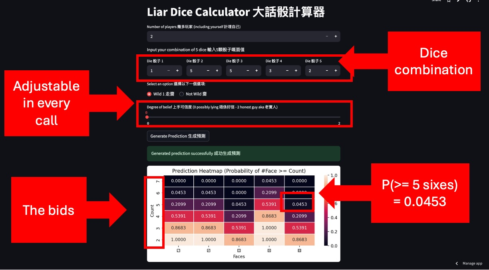

# Liar-Dice-Calculator

A handy tool to help you analyze and calculate probabilities in the classic bluffing game Liar's Dice (HK Version).
This calculator assists you in making informed decisions, by computing odds based on your current dice counts and bids,
to win and, ultimately, drink less alcohol in the night.

## Intro of Liar's Dice (HK Version)

Liar’s Dice is a popular bluffing dice game often played in Hong Kong bars and social gatherings. The game combines chance, psychology, and drinking fun.
Each player has a cup (dice shaker) containing 5 dice.
In each round, we take turns to make calls and have to correctly guess the total number of dice showing a certain face value among all players, or to catch others bluffing.

Some special rules:
- We don't lose any dice in the game, and instead, we drink.
- Getting a combo of 2, 3, 4, 5, 6 (each 1) makes the count in our hand equal to 0. Instead, each of the face value = 0 for our dice.

## Features
- Calculate the probability that a bid is valid given the number of dice and faces.
- Support for varying numbers of players.
- Interactive input for current bids and dice counts based on your trust to the player who makes a call.
- Support wild dice rules (aces as wild).

## How to Use
1. Go to https://liar-dice-calculator.streamlit.app
2. Input the number of players.
3. Enter your own dice.
4. Decide if the last guy next to you is bluffing (optional) to adjust probabilities.
5. Generate a probability heatmap.
6. Make current call and tune the degree of belief for your next call.

## Example

